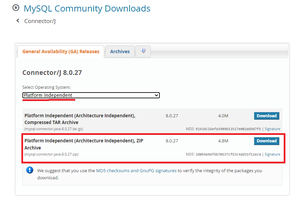
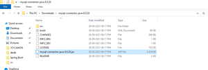

# Java Database Connectivity with MySQL

In Java, we can connect to our database(MySQL) with JDBC(Java Database Connectivity) through the Java code. JDBC is one of the standard APIs for database connectivity, using it we can easily run our query, statement, and also fetch data from the database.


#### Prerequisite

**1.** You have MySQL on your System. （Mac `system preference` ->  `MySQL` （version：8.0.15）

**2.** You have JDK on your System. （Mac run `java -version`

**3.** To set up the connectivity user should have MySQL Connector to the Java (JAR file), the ‘JAR’ file must be in classpath while compiling and running the code of JDBC.


#### Download MySQL Connector (Get `.jar`)

- In MySQL community downloads, go to the **Connector/J**.
- Then, select the Operating System **platform-independent**.
- Download the zip file **Platform Independent (Architecture Independent), ZIP Archive**.



- Extract the zip file and get the **mysql-connector-java-8.0.20.jar** file from the folder.




#### Setting up Database Connectivity with MySQL using JDBCcode

数据库中建立对应库、表：

**1.** create a database in MySQL, called `testdb` in this example.

**2**. create a table in that database.

**Example:** (consistent with example java code)

```sql
create table designation(
    code int primary key auto_increment,
    title char(35) not null unique
);
```

**3.** add some data manually


**工程文件目录：**

- create a directory (named `testproject`), inside which created 2 more directories: `src`, `lib` (just for convention).
- put the MySQL connector java `.jar` file in the `lib` folder. // 这样打包发布时不会弄丢


write connectivity code in the `src` folder  **代码**：

**4.** Information:

- **Driver class**:- The driver class for connectivity of MySQL database `com.mysql.cj.jdbc.Driver`
  - after the driver has been registered, we can obtain a Connection instance that is connected to a particular database by calling `DriverManager.getConnection()`
    - in this method, we need to pass URL for connection and name and password of the database.

- **URL for Connection**: for the mysql database is `jdbc:mysql://localhost:3306/testdb`
  -  `testdb` is the name of database.


```java
// Specify to the DriverManager which JDBC drivers to try to make Connections
  Class.forName("com.mysql.cj.jdbc.Driver"); 
  
// Get connection object
  Connection connection=DriverManager.getConnection("URL in string","username","password");
```

To get more clarification follow the full connectivity code below.


**5.** Create the `Check.java` file in the `src` folder as appendix.


**6.** Compile the program and run

##### Command Line

```shell
➜  src git:(master) ✗ javac -classpath ../lib/mysql-connector-java-8.0.15.jar:Check.java Check.java
➜  src git:(master) ✗ java -classpath ../lib/mysql-connector-java-8.0.15.jar:. Check 
# [20230524-1 issue_solved✅ Error: Could not find or load main class Check]
# Output: ...
# Code : 1 Title : somechar
```

##### IDEA / Eclipse

在`Build Path`中Library添加`.jar`文件


##### full Java code

```java
import java.sql.*;

public class Check {
	public static void main(String arg[])
	{
		Connection connection = null;
		try {
			// below two lines are used for connectivity.
			Class.forName("com.mysql.cj.jdbc.Driver");
			connection = DriverManager.getConnection(
				"jdbc:mysql://localhost:3306/testdb",
				"root", "root1234");
			// testdb is database to be use
			// root is name of database
			// root1234 is password of database

			Statement statement;
			statement = connection.createStatement();
			ResultSet resultSet;
			resultSet = statement.executeQuery(
				"select * from designation");
			int code;
			String title;
			while (resultSet.next()) {
				code = resultSet.getInt("code");
				title = resultSet.getString("title").trim();
				System.out.println("Code : " + code
								+ " Title : " + title);
			}
			resultSet.close();
			statement.close();
			connection.close();
		}
		catch (Exception exception) { // 不写try-catch程序会报错，有未处理的exception
			System.out.println(exception);
		}
	} // function ends
} // class ends


```


#### ISSUE

##### 20230524-1 Error✅ Could not find or load main class Check 

```bash
➜  src git:(master) ✗ java -classpath ../lib/mysql-connector-java-8.0.15.jar Check
# Error: Could not find or load main class Check
```

原因是，设置了`-classpath` 后，指令只寻找指定path中的程序[1]；而不会再在working directory找。

如果不指定`-classpath` ，则搜索的path就是working directory。

**解决办法：**指定多条classpath

**语法：**在Mac / Linux中，以`:`分隔多条path（Windows中可能不同 ）
https://blog.csdn.net/wl23301/article/details/35792235

```bash
➜  src git:(master) ✗ java -classpath ../lib/mysql-connector-java-8.0.15.jar:. Check 
```


-----

> [1] 所以会发现这样的输出结果和 随便写的class名 是一个效果
>
> ```bash
> ➜  src git:(master) ✗ java -classpath ../lib/mysql-connector-java-8.0.15.jar AAA
> # Error: Could not find or load main class AAA
> ```


